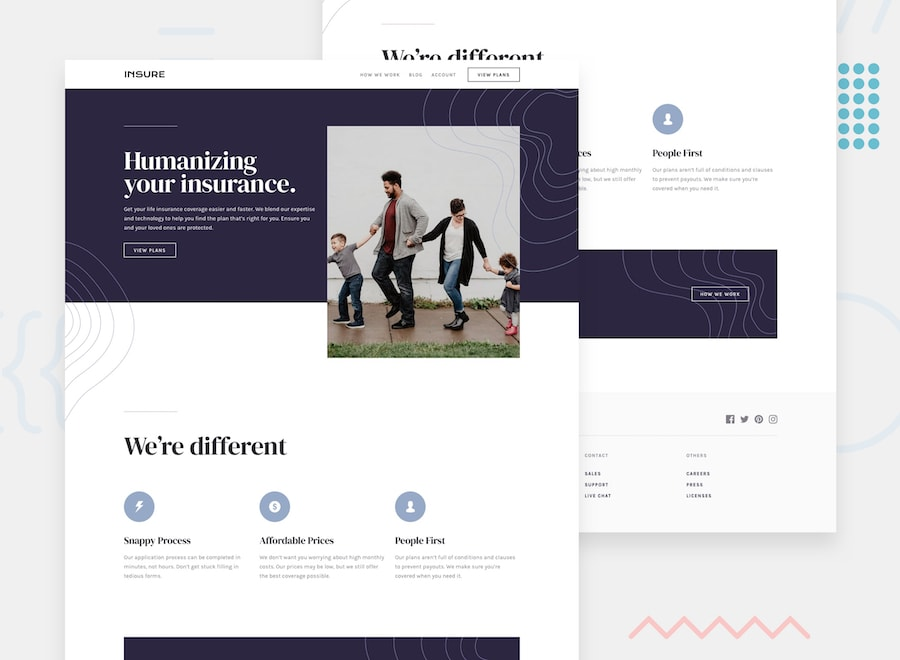

# Frontend Mentor - Insure landing page Challenge

## About the Challenge

The challenge is to develop a pricing component, as similar as possible to the image above.
Any type of tool you deem necessary can be used.

For the challenge, users must:
- View the ideal component layout depending on size.
- Visualize the iteration of elements when they are in the 'hover' state;

##Layout

It is possible to view all layouts (mobile and desktop) of the application in the `./design` folder

## Styling

It is possible to view the entire color scheme and fonts that should be used in the application through the `style-guide` file

## Technologies Used

- HTML
- CSS